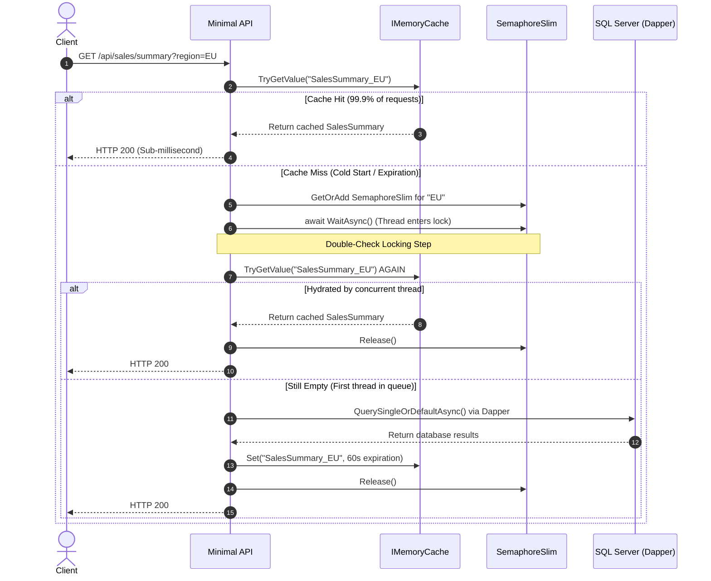
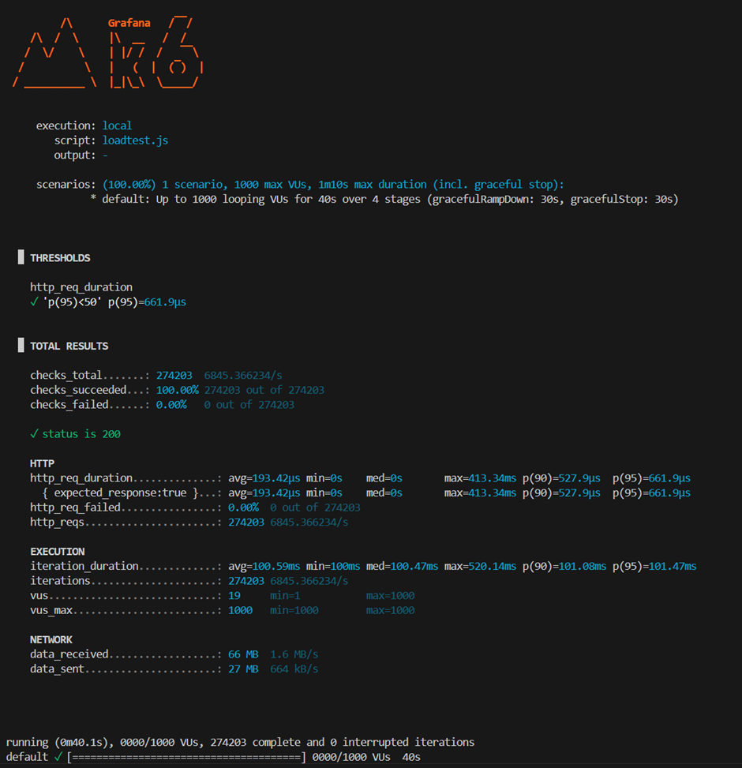

# High-Concurrency BI Core API (Proof of Concept)

An architectural Proof-of-Concept (PoC) demonstrating ultra-low-latency aggregate reporting on high-throughput business intelligence endpoints. Built with .NET 8/10 Minimal APIs, Dapper, and SQL Server, this system is engineered to sustain heavy concurrent traffic and pass rigorous load-testing benchmarks.

---

## The Problem

Executing high-overhead aggregate database queries (e.g., `SUM`, `AVG`, and `COUNT` calculations over millions of rows) under massive concurrent load exposes severe database performance bottlenecks:

1. **ORM Overhead:** Traditional Object-Relational Mappers (such as Entity Framework Core) introduce non-trivial CPU and memory allocations due to dynamic SQL generation, change tracking, and object instantiation.
2. **Connection Pool Exhaustion:** Under a sudden spike of concurrent traffic (e.g., 1,000 Virtual Users), a cold or expired cache triggers a **Cache Stampede** (Thundering Herd problem). All threads simultaneously attempt to open database connections and execute the heavy query. This instantly saturates the SQL Server connection pool, leading to connection timeouts, thread-pool starvation, and catastrophic system degradation.

---

## The Architecture

To achieve sub-millisecond latencies and protect the database layer, this PoC replaces heavy frameworks with a highly optimized, synchronized caching architecture:



### 1. Dapper Raw SQL Mapping
To eliminate object-tracking and query-translation overhead, we utilize **Dapper** to map raw, optimized SQL directly to C# records. This keeps memory allocation near-zero and ensures maximum data access throughput.

### 2. Double-Check Lock Cache Hydration
To eliminate the Thundering Herd bottleneck, we implement the **Lookaside Cache pattern** using `IMemoryCache` synchronized via a **Double-Check Locking** mechanism:
* **First-pass Check:** Threads attempt to read from the memory cache immediately without locking.
* **Granular Locking:** On a cache miss, the thread retrieves a region-specific `SemaphoreSlim(1,1)` from a static `ConcurrentDictionary`. This ensures synchronization is isolated by parameter (e.g., `Region = EU` locks separately from `Region = NA`).
* **Double-Check:** Once a thread acquires the lock, it immediately inspects the cache *a second time*. This ensures that if a preceding thread already populated the cache while this thread was waiting in line, the database is not hit again. The cached data is returned immediately, and the database executes the heavy query exactly **once** per cache expiration window.

---

## The Infrastructure

Every layer of the execution environment is optimized to eliminate blocking operations and system overhead:

* **ASP.NET Core Minimal APIs:** Built on a streamlined request pipeline without the overhead of the MVC Controller framework, keeping the HTTP pipeline extremely lightweight.
* **Stripping Blocking Loggers:** By default, Kestrel binds to blocking console loggers which easily cause thread-pool starvation under massive I/O loads. All default logging providers are stripped using `builder.Logging.ClearProviders()` to ensure non-blocking, asynchronous execution.
* **SQL Server Indexing Strategy:** The `SalesTransactions` table (containing 2,000,000 rows) is optimized with a targeted **Non-Clustered Index** covering the search predicate and aggregate fields:
  ```sql
  CREATE NONCLUSTERED INDEX IX_SalesTransactions_Region_Amount 
  ON SalesTransactions (Region) 
  INCLUDE (Amount);
  ```
  This transforms full table scans into highly efficient **Index Seeks**, ensuring that even when the cache is cold, the single database call completes in under 5ms.

---

## The Benchmark

To validate the micro-performance metrics under production-grade pressure, the system was subjected to a rigorous **k6 load test**:

* **Warm-up Phase:** 5 seconds of gentle scaling (5 VUs) to hydrate the system cache and pre-warm Kestrel.
* **Ramp-up Phase:** 10 seconds scaling up to **1,000 concurrent Virtual Users (VUs)**.
* **Steady-state Phase:** 20 seconds of sustained heavy load holding at 1,000 VUs.
* **Cooldown Phase:** 5 seconds scaling down to 0 VUs.
* **Client Emulation:** Regulated using a simulated 100ms client/network delay (`sleep(0.1)`) to mimic realistic client behavior while preventing client-side CPU bottlenecks.

---

## The Proof

Under full peak stress (1,000 VUs), the system successfully sustained throughput, completely eliminating database connection contention and maintaining flawless sub-millisecond latencies.


